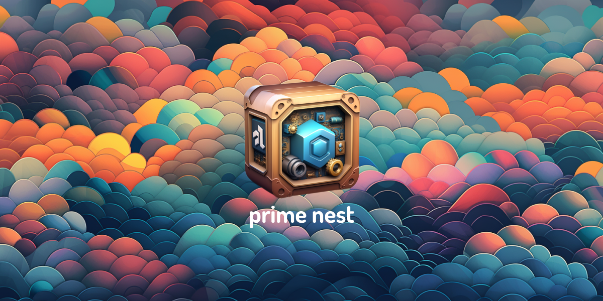

# 🚀 Prime NestJS – Scalable Backend Boilerplate

<p align="center">
  
</p>

A modern and production-ready **NestJS + PostgreSQL** boilerplate, tailored for developers and teams building secure, scalable backend APIs.

> ✅ Perfect for HRs and recruiters evaluating hands-on backend experience.

---

## 📊 Project Health

[](https://opensource.org/licenses/MIT)
[](https://snyk.io/test/github/josephgoksu/prime-nestjs)


## 🔥 Key Highlights

* ⚙️ **RESTful API** – Built with NestJS and Express
* 🔐 **Security First** – JWT Auth, RBAC, Helmet, and secure headers
* 🧠 **PostgreSQL with TypeORM** – Full migration & schema support
* 🐳 **Dockerized Setup** – Easy dev and production deployment
* 📚 **Swagger Documentation** – Built-in API Explorer
* 🧪 **Testing** – Unit, E2E, Coverage reports with Jest

---

## 📁 Project Structure

```
src/
├── auth/           # Auth & access control
├── config/         # Config & env
├── logger/         # Logging service
├── tasks/          # Task CRUD module
├── users/          # User profile module
├── app.module.ts   # Main App Module
└── main.ts         # Entry point
```

---

## 🛠️ Setup Instructions

### Prerequisites

* Node.js `>= 20.x`
* npm `>= 10.x`
* PostgreSQL `>= 14`
* Docker (optional but recommended)

### 🔧 Quick Start (Dev)

```bash
npm install
cp .env.example .env
npm run start:dev
```

### 🔐 Database Migrations

```bash
npm run schema:sync
npm run add:migration MigrationName
npm run apply:migration
npm run revert:migration
```

### 🐳 Docker Support

```bash
npm run docker:build
npm run docker:up
npm run docker:down
```

### 🧪 Testing Suite

```bash
npm run test       # Unit tests
npm run test:e2e   # End-to-end
npm run test:cov   # Coverage
```

---

## 🔑 Security Setup

### RSA Key Generation (for JWT RSA256)

```bash
# Private Key
openssl genrsa -out private_key.pem 2048
awk 'NF {sub(/\r/, ""); printf"%s\\n",\$0;}' private_key.pem

# Public Key
openssl rsa -in private_key.pem -outform PEM -pubout -out public_key.pem
awk 'NF {sub(/\r/, ""); printf "%s\\n",\$0;}' public_key.pem
```

---

## 🧪 API Documentation

* Swagger UI: [`http://localhost:3000/api`](http://localhost:3000/api)
* Import-ready **Insomnia** collection included in `/docs`

---

## 🤝 Contributing Guide

1. Fork the repository
2. Create a new branch (`feature/awesome-feature`)
3. Commit changes and push
4. Open a PR

---

## 👤 About the Developer

> **Chhatrapal Varma**
> Backend Developer | 2+ years experience | Docker, NestJS, PostgreSQL
> [LinkedIn](https://linkedin.com/in/jay-varma-472615225) • [GitHub](https://github.com/cybertron1408)

## ⭐ Star This Project

If you found this useful, give it a star and share it with others!

[](https://star-history.com/#josephgoksu/prime-nestjs&Timeline)

---

